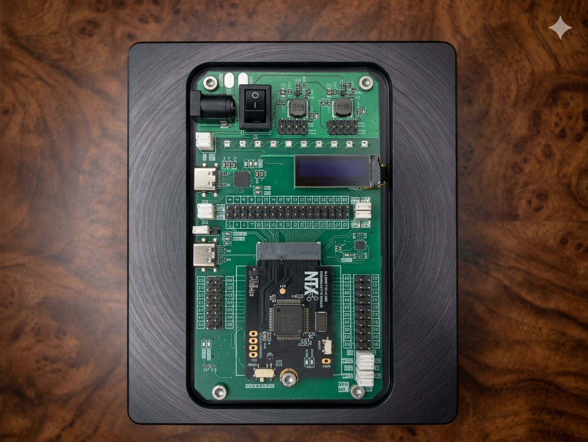
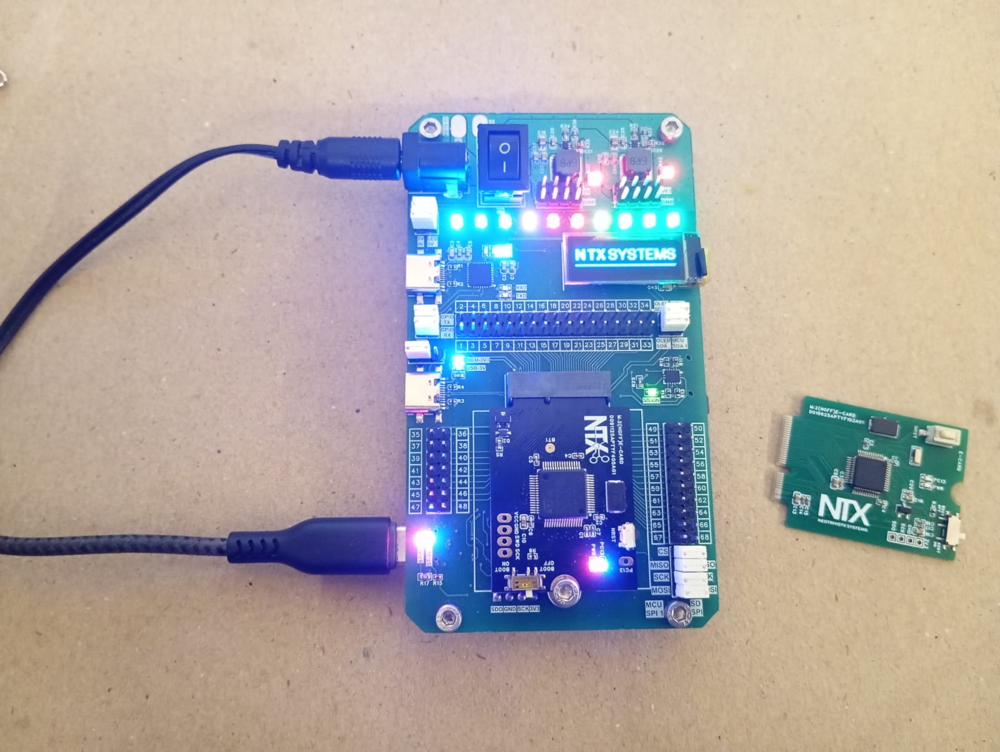

# ORBIT-Q
## Modular Embedded Development Workstation

---

## A Modular Development Workstation with Swappable MCU Architecture for Embedded, Robotics, and Drone Applications

| **Manufacturer** | NTX Systems Pvt. Ltd. |
| :--- | :--- |
| **Current MCU Cards** | STM32F103 (Cortex-M3), STM32F405 (Cortex-M4, hardware FPU) |
| **Roadmap** | ESP32, RP2040, CDAC Vega (RISC-V), nRF54, FPGA |
| **Programming** | C / C++ (Arduino Framework), MicroPython |
| **Hardware Design** | Proprietary / Closed-hardware |
| **Documentation & Drivers** | Open-source (MIT License) |

---

## Full Technical Specifications

| Parameter | Specification |
| :--- | :--- |
| **Input Voltage Range** | 6.0 V – 16.8 V DC (Recommended 12 V DC) |
| **Absolute Max Input** | 20.0 V DC |
| **Power Supply Inputs** | DC barrel jack + battery solder pads (mutually exclusive) |
| **Recommended Supply** | 12 V DC, 2.5 A or greater |
| **PWR-1 Rail** | 5.0 V @ 3 A (OLED, LEDs, SD card slot, M.2 slot) |
| **PWR-2 Rail** | 3.3 V @ 3 A (independent, reserved for external expansion) |
| **MCU Interface** | 75-position M.2 E-Key slot, custom pinout mapping |
| **GPIO Breakout** | 68 pins across 3 headers (A, B, C) |
| **Status Display** | 128×32 monochrome OLED, I²C (default address 0x3C) |
| **Addressable Lighting** | 10× WS2812B addressable RGB LEDs (5V rail) |
| **Data Storage** | Onboard microSD, SPI interface, 3.3V LDO |
| **USB-to-UART Bridge** | CP2102, USB Type-C, USB 2.0 Full Speed |
| **Hardware Debugger** | ST-Link V2 compatible (dedicated STM32F103), USB-C SWD port |

---

---

## Hardware Architecture & Ecosystem

-   :material-expansion-card-variant: **The Infrastructure Carrier**

    ---

    High-current power distribution (5V @ 3A and 3.3V @ 3A), dual USB Type-C interfaces, visual status displays, and full peripheral integration.

-   :material-chip: **The Swappable MCU Core**

    ---

    The target processor and minimal support circuitry on a 75-position M.2 E-Key footprint.

-   :material-sitemap: **Custom M.2 Pinout Mapping**

    ---

    Mechanically a standard M.2 connector, but electrically routes SWD debugging lines, dual power rails, SPI, I²C, UART, and 68 raw GPIO signals to dedicated expansion headers.

## MCU Card Ecosystem

-   :material-check-decagram: **STM32F103 Card**

    ---

    Initial validation card, ARM Cortex-M3, used to verify power distribution and interconnect signals.

-   :material-rocket-launch: **STM32F405 Card**

    ---

    Flagship high-performance target, 168 MHz ARM Cortex-M4 with hardware FPU, for real-time DSP, motor control, and sensor processing.

-   :material-router-wireless: **Planned Roadmap Targets**

    ---

    ESP32, RP2040, CDAC Vega (RISC-V), nRF54, and FPGA module cards, at roughly 60–90 day intervals. *(Roadmap items, not shipping yet.)*

!!! note "Beyond the Dev Board"
    The same MCU card standard extends to at least four carrier form factors — an education baseboard, a robotics mini carrier, a wireless-first carrier, and a modular drone baseboard — all electrically and mechanically compatible with the cards above.

---

---

## Why STM32, and Why Modular

Arduino and ESP32 dominate India's embedded landscape on cost and tutorial volume; STM32 stays underused at the learning stage despite being the more relevant architecture for real unmanned/embedded systems work. Raspberry Pi, meanwhile, is typically chosen for AI/compute showcase projects rather than MCU-level work.

The comparison that matters isn't bare board price — it's total cost to a working setup, once an external programmer, power supply, and breadboarded peripherals are accounted for. ORBIT-Q folds those into the board itself, and the M.2 card system means moving from a validation-tier MCU to a flagship-tier one doesn't require rebuilding the setup from scratch.

!!! quote ""
    First introduced to the r/embedded community without any product branding, as a blind technical validation test — 9,000+ views, a 98% upvote ratio, and direct feedback from engineers in the STM32 community.

---

<video autoplay muted loop playsinline width="60%">
  <source src="/Orbit-Q/images/videos/orbit-q-video-001.mp4" type="video/mp4">
</video>

---

## Quick Resources

* 📄 **Datasheet:** [Download Orbit-Q Datasheet PDF](./Orbit-Q%20Datasheet.pdf)
* 📷 **Board Photos:** [Browse the gallery](images/readme.md)

---

-   :material-swap-horizontal-bold: **Swappable Compute Core**

    ---

    ORBIT-Q separates infrastructure from compute. The carrier provides onboard power delivery, debugging, display, and storage — the MCU itself is the only part that swaps, via a 75-position M.2 E-Key slot with a custom pinout mapping. Moving from a validation-tier MCU card to a flagship-tier one requires no rewiring and no new tooling.

-   :material-tools: **Integrated Development Infrastructure**

    ---

    ORBIT-Q ships with an onboard ST-Link + CP2102 debug and programming interface, a 128×32 OLED status display, 10× WS2812B addressable RGB LEDs, and onboard microSD storage — the peripherals most embedded projects end up breadboarding project after project, built in instead.

-   :material-flash: **Dual-Rail Power Delivery**

    ---

    A 24W dual-rail power system (5V @ 3A, 3.3V @ 3A) accepts 6.0V–16.8V DC input via barrel jack or battery solder pads, removing the need for a separate bench supply during development.

-   :material-vector-line: **Full GPIO and Peripheral Access**

    ---

    68 raw GPIO signals are broken out across three headers (A, B, C), alongside dedicated SPI, I²C, UART, and dual power rails routed through the M.2 connector to the MCU card — full access to the target processor's capability, not a reduced subset.

----

## License

All documentation, sample code, and software drivers in this repository are released under the [MIT License](LICENSE). Hardware designs, layout files, and product specifications remain the proprietary IP of **NTX Systems Pvt. Ltd.**
