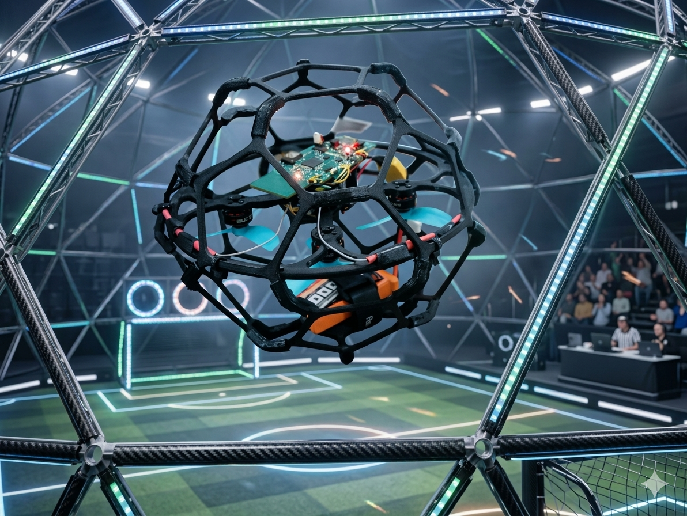

# Sparrow Soccer Drone — Overview

**A 250g-class racing drone platform built by NTX Systems for drone soccer, engineered around Betaflight and ArduPilot firmware.**

## About Sparrow

Sparrow is a compact, cage-protected quadcopter designed for high-speed, collision-tolerant flight — built for drone soccer play, where mid-air contact between drones is expected rather than avoided. The full-coverage protective frame keeps propellers enclosed during impacts, while the internal flight stack handles the actual flight dynamics.

## Firmware & Flight Stack

Sparrow supports two firmware paths depending on use case:

- **Betaflight** — tuned for raw agility and rate-based manual control, suited to competitive play
- **ArduPilot** — used for more structured flight modes and autonomous behavior development

## Status

Sparrow is a secondary product alongside [ORBIT-Q](../orbit-q-overview.md), developed and flight-validated internally. Full specifications and configuration guides are being added here as documentation is finalized.
