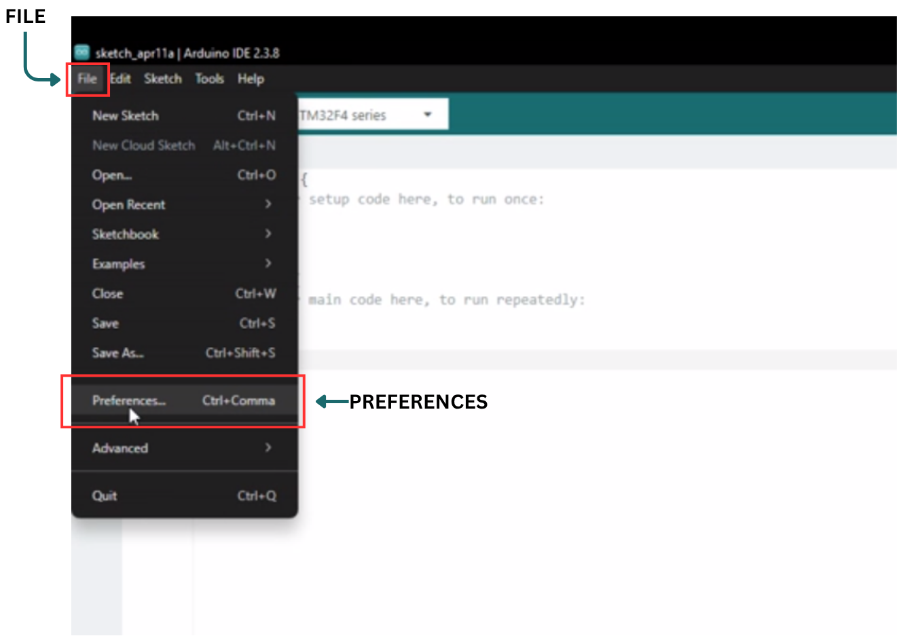
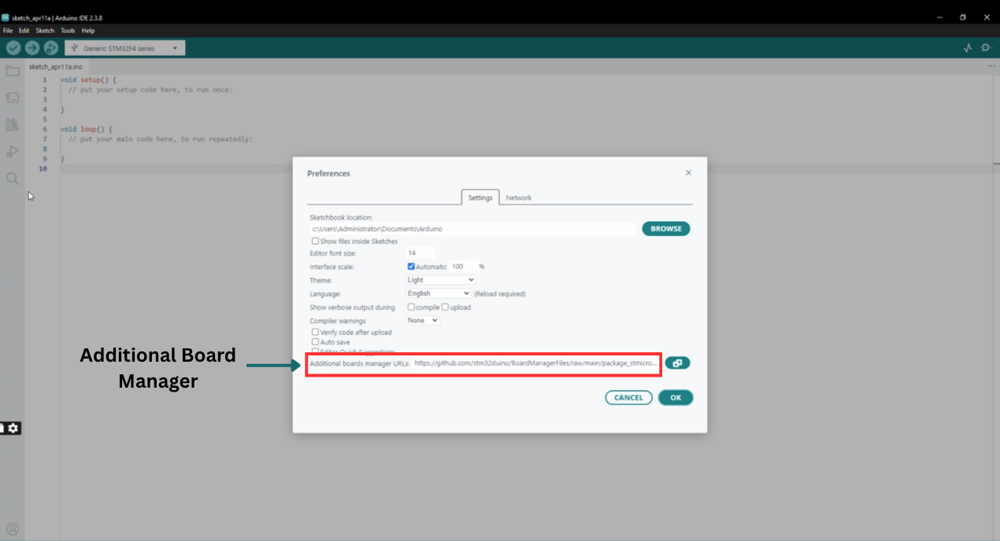
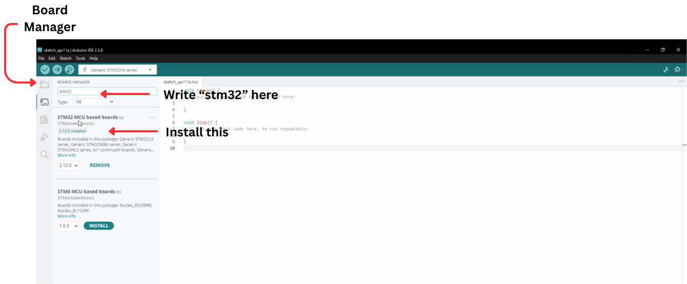
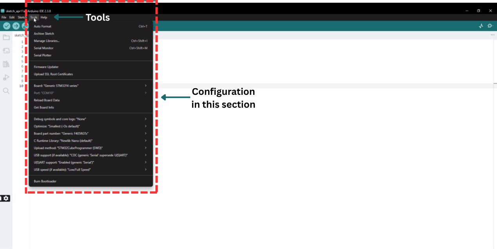

# Getting Started Guide: STM32F405RGT6 MCU-Card

Set up the Arduino IDE to program the STM32F405 MCU card on Orbit-Q, using the official STM32duino core.

## Prerequisites

| Requirement | Notes |
| :--- | :--- |
| Arduino IDE | Version 2.x recommended |
| Orbit-Q board | With STM32F405 MCU card seated |
| USB Type-C cable | For CP2102 UART connection |

---

## 1. Configure Arduino IDE

Open the Preferences window by navigating to **File > Preferences**.



---

## 2. Add Board URL

In the **"Additional Boards Manager URLs"** field, paste the official STM32 index link:

```text
https://github.com/stm32duino/BoardManagerFiles/raw/main/package_stmicroelectronics_index.json
```



---

## 3. Install Boards

1. Go to **Tools > Board > Boards Manager**
2. Search for **"STM32 MCU based boards"**
3. Click **Install**



---

## 4. Install Support Tools (Optional but Recommended)

Download and install **STM32CubeProgrammer** from STMicroelectronics. It acts as a bridge for uploading code and ensures you have the necessary USB/SWD drivers installed.

[Download STM32CubeProgrammer from STMicroelectronics](https://www.st.com/en/development-tools/stm32cubeprog.html)

---

## 5. Select Your Board and Settings

Once installed, configure your hardware settings under the **Tools** menu:

| Menu Item | Selected Setting | Notes |
| :--- | :--- | :--- |
| **Board** | Generic STM32F4 series | Core STM32 architecture package |
| **Board Part Number** | Generic F405RGTx | Target MCU variant |



**Upload Method** — this depends on your hardware connection:

| Method | Use Case |
| :--- | :--- |
| **ST-Link** | Best for debugging; requires an ST-Link V2 programmer |
| **STM32CubeProgrammer (Serial)** | Used with a USB-to-TTL adapter |
| **STM32CubeProgrammer (DFU)** | Used if your board has a native USB port and DFU bootloader |

---

## Troubleshooting

!!! failure "Board Not Appearing in Boards Manager"
    - Confirm the board URL was pasted exactly as shown, with no extra spaces
    - Restart the Arduino IDE after adding the URL — the Boards Manager list only refreshes on launch
    - Check your internet connection; the Boards Manager fetches the index live from GitHub

!!! failure "STM32CubeProgrammer Not Detecting the Board"
    - Confirm USB drivers were installed correctly during STM32CubeProgrammer setup
    - Try a different USB cable — some cables are power-only and lack data lines
    - On Windows, check Device Manager for the correct COM port assignment

---

!!! tip "Next Step"
    Once your environment is configured, head to the [Blink Example](../Blink-Example/text.md) to flash your first program.
