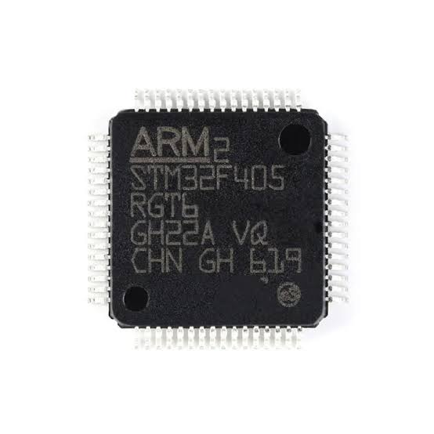
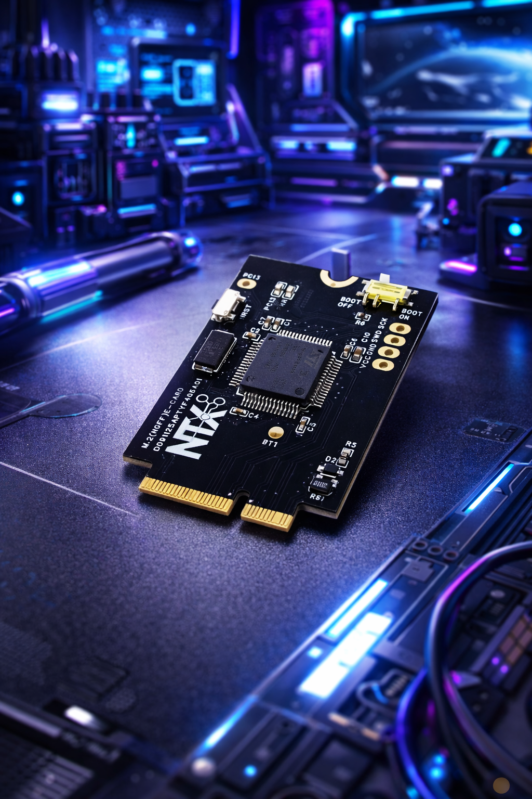

# Orbit-Q: MCU Card
# STM32F405 MCU Card Development Platform - Specification, Pinout and Reference Guide

The STM32F405RGT6 is a mainstream high-performance microcontroller from STMicroelectronics built around the 32-bit ARM Cortex-M4 RISC core featuring a hardware Floating Point Unit (FPU) and full Digital Signal Processing (DSP) instruction sets. Operating at speeds up to 168 MHz and equipped with ST's Adaptive Real-Time (ART Accelerator), it executes instructions directly from Flash memory with zero wait states, delivering exceptional computational throughput for resource-constrained edge applications.

<div align="center" markdown>

</div>

### About STM32F405RGT6 Micro-Controller from ST Microelectronics

### Key Technical Specifications
- Core Architecture: ARM 32-bit Cortex-M4 with FPU and DSP instructions
- Maximum Frequency: $168\,\text{MHz}$ (210 DMIPS / 1.25 DMIPS/MHz)
- Memory Configuration: $1\,\text{MB}$ of Flash memory and $192\,\text{KB}$ of SRAM (+ $4\,\text{KB}$ backup SRAM)
- Analog Peripherals: Two 12-bit ADCs (up to 24 channels) and two 12-bit DAC channels
- Connectivity & Interfaces: USB 2.0 OTG FS/HS, up to 3x I2C, 4x USARTs, 2x UARTs, 3x SPIs (with I2S audio support), 2x CAN interfaces, and SDIO
- Timers: Advanced-control motor-control timers, general-purpose 16-bit and 32-bit timers, and dual watchdog timers

### Real-World Applications & Capabilities
- Drones & Flight Controllers: Widely deployed in high-performance multirotor flight control boards (such as Betaflight configurations) because its fast floating-point math efficiently handles high-speed sensor fusion and PID loop calculations.
- Advanced Robotics & Motor Control: Utilizes hardware-backed PWM timers and encoder interfaces to drive precise brushless DC (BLDC) motors, kinematic calculations, and real-time mechanical feedback loops.
- Industrial Automation: Powers programmable logic controllers (PLCs), multi-sensor data aggregators, and robust communication nodes leveraging industrial protocols like CAN bus.
- IoT & Modular Edge Devices: Delivers ample processing overhead for local data preprocessing, cryptographic communication stacks, and high-density modular carrier architectures.
- Edge AI & TinyML Capabilities (STM32Cube.AI): Beyond traditional control loops, the STM32F405RGT6 is fully equipped to execute lightweight machine learning and deep learning models at the edge using STM32Cube.AI. By leveraging the integrated ARM Cortex-M4 FPU and DSP instruction set, the microcontroller efficiently handles single-precision floating-point matrix multiplications, vector operations, and neural network inference layers.
 - Practical AI Use Cases at the Edge:
    * Predictive Maintenance: Running anomaly detection and vibration analysis directly on industrial motors or rotating machinery by processing high-frequency accelerometer data.
    * Audio Classification & Keyword Spotting: Executing compact convolutional neural networks (CNNs) for localized speech recognition or acoustic event detection without relying on cloud connectivity.
    * Sensor Fusion & Intelligent Filtering: Deploying tiny neural networks to clean noisy sensor inputs, perform gesture recognition, or adaptively tune control algorithms in real time.

### Software Ecosystem & Development Environments
- Arduino IDE & PlatformIO: Fully supported via community and official STM32 core packages, allowing developers to build and upload projects using familiar Arduino libraries and frameworks.
- Professional IDEs: Compatible with STM32CubeIDE, Keil MDK, and IAR Embedded Workbench for advanced bare-metal, register-level, or FreeRTOS-based industrial development.

### MicroPython Support & Advantages
**The STM32F405 is MicroPython’s original target platform, launched alongside the official Pyboard in a 2013 Kickstarter campaign. Its hardware profile—featuring a 168 MHz ARM Cortex-M4 core, FPU, 1 MB Flash, and 192 KB SRAM—was specifically chosen as the ideal sweet spot for running a bare-metal Python interpreter. Consequently, the STM32 port serves as the project's foundational baseline, with peripheral drivers deeply optimized for this architecture.**
- Native MicroPython Execution: Runs lightweight Python 3 scripts directly on the bare metal, drastically accelerating the prototyping lifecycle without requiring C/C++ compilation for every iteration.
- Performance Benefits for MicroPython:
  * Generous Memory Footprint: The 1 MB Flash memory provides ample storage for the MicroPython firmware image alongside user scripts, while the 192 KB SRAM easily handles interpreter runtime overhead and dynamic variable allocation.
  * Speed & Floating-Point Efficiency: The 168 MHz clock speed paired with the hardware Floating Point Unit (FPU) mitigates the performance penalty typically associated with interpreted languages, ensuring responsive script execution and efficient mathematical computations.

### Drone & Flight Control Firmware Ecosystem
- Betaflight & INAV: Historically established as a powerhouse MCU for high-performance multirotor and fixed-wing flight controllers, efficiently executing high-frequency PID loops, gyro filtering, and real-time stabilization.
- ArduPilot: Capable of running advanced autonomous navigation routines, waypoint tracking, and complex multi-sensor fusion stacks for intelligent robotics.

**The chip's blend of heavy crunching power, deterministic real-time behavior, and diverse peripheral integration makes it an industry standard for professional embedded engineering and rapid prototyping.**


---

<div align="center" markdown>

</div>

## STM32F405RGT6 M.2 E-Card Hardware Specification

### Overview

This documentation outlines the hardware specifications, layout features, and pin configuration for the NTX Systems custom STM32F405RGT6 M.2 E-Card (Part Number: `D091125APTYF405A01`). Built on an M.2 E-Key (NGFF) form factor, this compact module packs a high-performance ARM Cortex-M4 microcontroller into a standardized edge-connector design.

### Core Specifications

- Microcontroller: STMicroelectronics STM32F405RGT6 (ARM Cortex-M4 32-bit RISC core with FPU)
- Operating Frequency: Up to $168\,\text{MHz}$
- Flash Memory: $1\,\text{MB}$
- SRAM: $192\,\text{KB}$ (+ $4\,\text{KB}$ backup SRAM)
- Clock Source: $8\,\text{MHz}$ High-Speed External (HSE) crystal oscillator (Note: No OSC32 low-speed crystal installed)
- Operating Voltage: $3.3\,\text{V}$ nominal input, regulated via onboard safety components
- Part Number: `D091125APTYF405A01`

<div align="center" markdown>

</div>

### Power Management & Safety

- Reverse Polarity Protection: The $3.3\,\text{V}$ power input line features an integrated hardware reverse polarity protection circuit to prevent damage from incorrect power supply connections.
- Power LED: An onboard power indicator LED wired directly to the $3.3\,\text{V}$ rail indicates active power status

### Onboard Controls & User Interface

- Reset Button (NRST): Tactile push-button switch connected to the microcontroller's hardware reset line.
- Boot Mode Selector: Onboard slide switch for configuring the `BOOT0` pin state easily between operational modes (Boot OFF / Boot ON).
- Status LED (PC13): Dedicated user/status LED connected to pin `PC13` in an active-high configuration (LED lights up when `PC13` goes HIGH).

### Solder Pads & Extra Access Points

Because `PC13` is utilized by the onboard status LED, it is omitted from the standard edge connector interface. However, dedicated test/solder pads are provided on the PCB for advanced access:

* <kbd>3V3</kbd> — Power rail access

* <kbd>GND</kbd> — Ground reference

* <kbd>SWDIO</kbd> — Serial Wire Debug Data

* <kbd>SWCLK</kbd> — Serial Wire Debug Clock

* <kbd>BOOT1</kbd> — **BOOT1* configuration point

* <kbd>PC13</kbd> — Direct access pad for pin **PC13* (bypassing the basic interface)


## 1. Complete M.2 Pinout Mapping (Pins 1–68)

| Pin (Left) | Signal / Function | Pin (Right) | Signal / Function |
| :---: | :--- | :---: | :--- |
| **1** | VCC (3.3V / VIN) | **2** | VCC (3.3V / VIN) |
| **3** | GND | **4** | GND |
| **5** | PA14 (SWD / SWCLK) | **6** | PA13 (SWD / SWDIO) |
| **7** | GND | **8** | PA12 (USB-OTG / CAN1_TX) |
| **9** | PA11 (USB-OTG / CAN1_RX) | **10** | GND |
| **11** | PB15 (SPI2_MOSI) | **12** | PB14 (SPI2_MISO) |
| **13** | PB13 (SPI2_SCK) | **14** | PB12 (SPI2_NSS / CS) |
| **15** | GND | **16** | PB11 (I2C2_SDA / UART3_RX) |
| **17** | PB10 (I2C2_SCL / UART3_TX) | **18** | PB1 |
| **19** | PB0 | **20** | PC5 |
| **21** | PC4 | **22** | PA7 (SPI1_MOSI / TIM3_CH2) |
| **23** | PA6 (SPI1_MISO / TIM3_CH1) | **24** | PA5 (SPI1_SCK) |
| **25** | PA4 (SPI1_NSS / SD Card CS) | **26** | PA3 (USART2_RX) |
| **27** | GND | **28** | PA2 (USART2_TX) |
| **29** | PA1 (UART4_RX) | **30** | PA0 (UART4_TX / WKUP) |
| **31** | PC3 | **32** | PC2 |
| **33** | PC1 | **34** | PC0 |
| **35** | VCC | **36** | VCC |
| **37** | GND | **38** | GND |
| **39** | N.C. | **40** | N.C. |
| **41** | N.C. | **42** | N.C. |
| **43** | GND | **44** | PC6 (USART6_TX) |
| **45** | PC7 (USART6_RX) | **46** | PC8 |
| **47** | PC9 (I2C3_SDA) | **48** | N.C. |
| **49** | PC14 (OSC32_IN) | **50** | PC15 (OSC32_OUT) |
| **51** | PB9 | **52** | PB8 (TIM4_CH3) |
| **53** | BOOT0 | **54** | PB7 (I2C1_SDA / TIM4_CH2) |
| **55** | GND | **56** | PB6 (I2C1_SCL / TIM4_CH1) |
| **57** | PB5 | **58** | PB4 |
| **59** | PB3 (JTDO / TRACESWO) | **60** | PD2 (UART5_RX) |
| **61** | PC12 (SPI3_MOSI / UART5_TX) | **62** | PC11 (SPI3_MISO / UART3_RX) |
| **63** | PC10 (SPI3_SCK) | **64** | PA15 (SPI3_NSS) |
| **65** | PA10 (USART1_RX / TIM1_CH3) | **66** | PA9 (USART1_TX / TIM1_CH2) |
| **67** | GND | **68** | PA8 (I2C3_SCL / TIM1_CH1) |

---

## 2. Onboard Peripherals & Default Pin Mapping

*   **Onboard OLED Display ($128\times32$, SSD1306):**
    *   **Protocol:** I2C1 (`PB6` = SCL, `PB7` = SDA)
    *   **I2C Address:** `0x3C`
    *   **Isolation Jumper:** **JP-2** (Bridge to connect MCU to display)
*   **MicroSD Card Slot:**
    *   **Protocol:** Hardware SPI1 (`PA4` = CS, `PA5` = SCK, `PA6` = MISO, `PA7` = MOSI)
    *   **Isolation Jumper:** **JP-5**
*   **USB-to-UART Bridge (CP2102):**
    *   **Isolation Jumper:** **JP-3**
*   **Onboard ST-LINK Debugger:**
    *   **Protocol:** SWD (`PA13` = SWDIO, `PA14` = SWCLK via Header A)

---

### 3. STM32F405RGT6 MCU Pin Details

| Pin No. | Pin name after reset | Pin type | I/O structure | Alternate functions | Additional functions |
| :--- | :--- | :--- | :--- | :--- | :--- |
| Solder Pad | `PC13` | I/O | FT | EVENTOUT | RTC_AF1 |
| 49 | `PC14-OSC32_IN (PC14)` | I/O | FT | EVENTOUT | OSC32_IN(4) |
| 50 | `PC15- OSC32_OUT (PC15)` | I/O | FT | EVENTOUT | OSC32_OUT |
| 34 | `PC0` | I/O | FT | OTG_HS_ULPI_STP/ EVENTOUT | ADC123_IN10 |
| 33 | `PC1` | I/O | FT | ETH_MDC/ EVENTOUT | ADC123_IN11 |
| 32 | `PC2` | I/O | FT | SPI2_MISO /OTG_HS_ULPI_DIR /TH_MII_TXD2/I2S2ext_SD/ EVENTOUT | ADC123_IN12 |
| 31 | `PC3` | I/O | FT | SPI2_MOSI / I2S2_SD / OTG_HS_ULPI_NXT / ETH_MII_TX_CLK/ EVENTOUT | ADC123_IN13 |
| 30 | `PA0-WKUP (PA0)` | I/O | FT | USART2_CTS/ UART4_TX/ ETH_MII_CRS / TIM2_CH1_ETR/ TIM5_CH1 / TIM8_ETR/ EVENTOUT | ADC123_IN0/WKUP(4) |
| 29 | `PA1` | I/O | FT | USART2_RTS / UART4_RX/ ETH_RMII_REF_CLK / ETH_MII_RX_CLK / TIM5_CH2 / TIMM2_CH2/ EVENTOUT | ADC123_IN1 |
| 28 | `PA2` | I/O | FT | USART2_TX/TIM5_CH3 / TIM9_CH1 / TIM2_CH3 / ETH_MDIO/ EVENTOUT | ADC123_IN2 |
| 26 | `PA3` | I/O | FT | USART2_RX/TIM5_CH4 / TIM9_CH2 / TIM2_CH4 / OTG_HS_ULPI_D0 / ETH_MII_COL/ EVENTOUT | ADC123_IN3 |
| 25 | `PA4` | I/O | TC | SPI1_NSS / SPI3_NSS / USART2_CK / DCMI_HSYNC / OTG_HS_SOF/ I2S3_WS/ EVENTOUT | ADC12_IN4 /DAC1_OUT |
| 24 | `PA5` | I/O | TC | SPI1_SCK/ OTG_HS_ULPI_CK / TIM2_CH1_ETR/ TIM8_CHIN/ EVENTOUT | ADC12_IN5/ DAC2_OUT |
| 23 | `PA6` | I/O | FT | SPI1_MISO / TIM8_BKIN/TIM13_CH1 / DCMI_PIXCLK / TIM3_CH1 / TIM1_BKIN/ EVENTOUT | ADC12_IN6 |
| 22 | `PA7` | I/O | FT | SPI1_MOSI/ TIM8_CH1N / TIM14_CH1/TIM3_CH2/ ETH_MII_RX_DV / TIM1_CH1N / RMII_CRS_DV/ EVENTOUT | ADC12_IN7 |
| 21 | `PC4` | I/O | FT | ETH_RMII_RX_D0 / ETH_MII_RX_D0/ EVENTOUT | ADC12_IN14 |
| 20 | `PC5` | I/O | FT | ETH_RMII_RX_D1 / ETH_MII_RX_D1/ EVENTOUT | ADC12_IN15 |
| 19 | `PB0` | I/O | FT | TIM3_CH3 / TIM8_CH2N/ OTG_HS_ULPI_D1/ ETH_MII_RXD2 / TIM1_CH2N/ EVENTOUT | ADC12_IN8 |
| 18 | `PB1` | I/O | FT | TIM3_CH4 / TIM8_CH3N/ OTG_HS_ULPI_D2/ ETH_MII_RXD3 / TIM1_CH3N/ EVENTOUT | ADC12_IN9 |
| Solder Pad | `PB2-BOOT1 (PB2)` | I/O | FT | EVENTOUT | - |
| 17 | `PB10` | I/O | FT | SPI2_SCK / I2S2_CK / I2C2_SCL/ USART3_TX / OTG_HS_ULPI_D3 / ETH_MII_RX_ER / TIM2_CH3/ EVENTOUT | - |
| 16 | `PB11` | I/O | FT | I2C2_SDA/USART3_RX/ OTG_HS_ULPI_D4 / ETH_RMII_TX_EN/ ETH_MII_TX_EN / TIM2_CH4/ EVENTOUT | - |
| 14 | `PB12` | I/O | FT | SPI2_NSS / I2S2_WS / I2C2_SMBA/ USART3_CK/ TIM1_BKIN / CAN2_RX / OTG_HS_ULPI_D5/ ETH_RMII_TXD0 / ETH_MII_TXD0/ OTG_HS_ID/ EVENTOUT | - |
| 13 | `PB13` | I/O | FT | SPI2_SCK / I2S2_CK / USART3_CTS/ TIM1_CH1N /CAN2_TX / OTG_HS_ULPI_D6 / ETH_RMII_TXD1 / ETH_MII_TXD1/ EVENTOUT | OTG_HS_VBUS |
| 12 | `PB14` | I/O | FT | SPI2_MISO/ TIM1_CH2N / TIM12_CH1 / OTG_HS_DM/ USART3_RTS / TIM8_CH2N/I2S2ext_SD/ EVENTOUT | - |
| 11 | `PB15` | I/O | FT | SPI2_MOSI / I2S2_SD/ TIM1_CH3N / TIM8_CH3N / TIM12_CH2 / OTG_HS_DP/ EVENTOUT | - |
| 44 | `PC6` | I/O | FT | I2S2_MCK / TIM8_CH1/SDIO_D6 / USART6_TX / DCMI_D0/TIM3_CH1/ EVENTOUT | - |
| 45 | `PC7` | I/O | FT | I2S3_MCK / TIM8_CH2/SDIO_D7 / USART6_RX / DCMI_D1/TIM3_CH2/ EVENTOUT | - |
| 46 | `PC8` | I/O | FT | TIM8_CH3/SDIO_D0 /TIM3_CH3/ USART6_CK / DCMI_D2/ EVENTOUT | - |
| 47 | `PC9` | I/O | FT | I2S_CKIN/ MCO2 / TIM8_CH4/SDIO_D1 / /I2C3_SDA / DCMI_D3 / TIM3_CH4/ EVENTOUT | - |
| 68 | `PA8` | I/O | FT | MCO1 / USART1_CK/ TIM1_CH1/ I2C3_SCL/ OTG_FS_SOF/ EVENTOUT | - |
| 66 | `PA9` | I/O | FT | USART1_TX/ TIM1_CH2 / I2C3_SMBA / DCMI_D0/ EVENTOUT | OTG_FS_VBUS |
| 65 | `PA10` | I/O | FT | USART1_RX/ TIM1_CH3/ OTG_FS_ID/DCMI_D1/ EVENTOUT | - |
| 9 | `PA11` | I/O | FT | USART1_CTS / CAN1_RX / TIM1_CH4 / OTG_FS_DM/ EVENTOUT | - |
| 8 | `PA12` | I/O | FT | USART1_RTS / CAN1_TX/ TIM1_ETR/ OTG_FS_DP/ EVENTOUT | - |
| 6 | `PA13 (JTMS-SWDIO)` | I/O | FT | JTMS-SWDIO/ EVENTOUT | - |
| 5 | `PA14 (JTCK-SWCLK)` | I/O | FT | JTCK-SWCLK/ EVENTOUT | - |
| 64 | `PA15 (JTDI)` | I/O | FT | JTDI/ SPI3_NSS/ I2S3_WS/TIM2_CH1_ETR / SPI1_NSS / EVENTOUT | - |
| 63 | `PC10` | I/O | FT | SPI3_SCK / I2S3_CK/ UART4_TX/SDIO_D2 / DCMI_D8 / USART3_TX/ EVENTOUT | - |
| 62 | `PC11` | I/O | FT | UART4_RX/ SPI3_MISO / SDIO_D3 / DCMI_D4/USART3_RX / I2S3ext_SD/ EVENTOUT | - |
| 61 | `PC12` | I/O | FT | UART5_TX/SDIO_CK / DCMI_D9 / SPI3_MOSI /I2S3_SD / USART3_CK/ EVENTOUT | - |
| 60 | `PD2` | I/O | FT | TIM3_ETR/UART5_RX/ SDIO_CMD / DCMI_D11/ EVENTOUT | - |
| 59 | `PB3 (JTDO/ TRACESWO)` | I/O | FT | JTDO/ TRACESWO/ SPI3_SCK / I2S3_CK / TIM2_CH2 / SPI1_SCK/ EVENTOUT | - |
| 58 | `PB4 (NJTRST)` | I/O | FT | NJTRST/ SPI3_MISO / TIM3_CH1 / SPI1_MISO / I2S3ext_SD/ EVENTOUT | - |
| 57 | `PB5` | I/O | FT | I2C1_SMBA/ CAN2_RX / OTG_HS_ULPI_D7 / ETH_PPS_OUT/TIM3_CH 2 / SPI1_MOSI/ SPI3_MOSI / DCMI_D10 / I2S3_SD/ EVENTOUT | - |
| 56 | `PB6` | I/O | FT | I2C1_SCL/ TIM4_CH1 / CAN2_TX / DCMI_D5/USART1_TX/ EVENTOUT | - |
| 54 | `PB7` | I/O | FT | I2C1_SDA / FSMC_NL / DCMI_VSYNC / USART1_RX/ TIM4_CH2/ EVENTOUT | - |
| 53 | `BOOT0` | I | B | - | VPP |
| 52 | `PB8` | I/O | FT | TIM4_CH3/SDIO_D4/ TIM10_CH1 / DCMI_D6 / ETH_MII_TXD3 / I2C1_SCL/ CAN1_RX/ EVENTOUT | - |
| 51 | `PB9` | I/O | FT | SPI2_NSS/ I2S2_WS / TIM4_CH4/ TIM11_CH1/ SDIO_D5 / DCMI_D7 / I2C1_SDA / CAN1_TX/ EVENTOUT | - |


## 4. Arduino IDE Setup & Configuration

1. **Add Board Manager URL:**
   Open Arduino IDE, go to **File > Preferences**, and paste the following URL into *Additional board manager URLs*:
   ```text
   [https://github.com/stm32duino/BoardManagerFiles/raw/main/package_stmicroelectronics_index.json](https://github.com/stm32duino/BoardManagerFiles/raw/main/package_stmicroelectronics_index.json)
